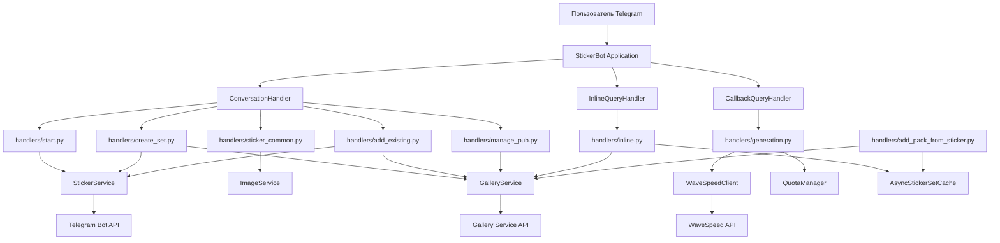
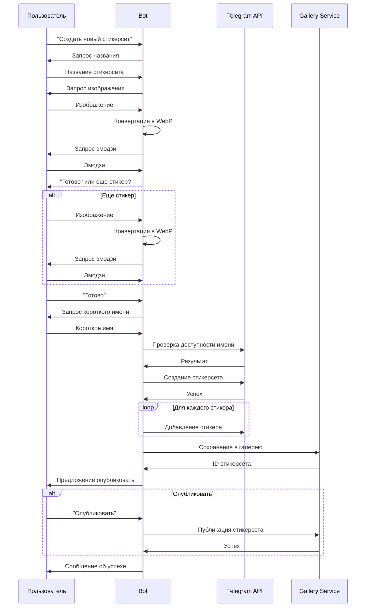
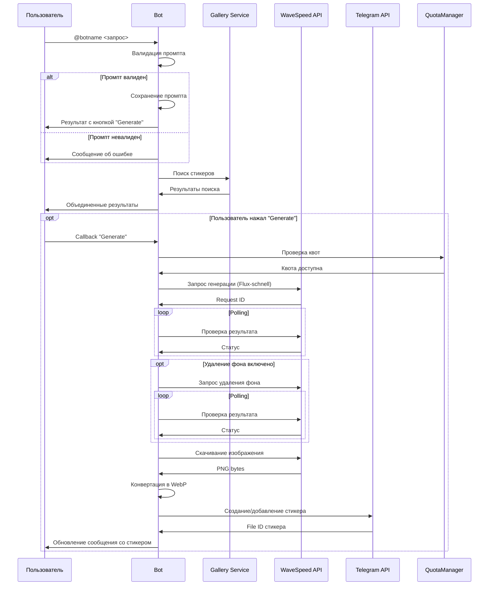

# Архитектура StickerBot

## Обзор

StickerBot — Telegram-бот для создания стикерсетов, управления ими и интеграции с галереей стикеров. Бот поддерживает генерацию стикеров через AI, поиск в галерее и управление публикацией наборов.

## Общая схема архитектуры



## Внешние сервисы

### 1. Telegram Bot API
- **Сервис**: `StickerService` → `StickerManager`
- **Использование**:
  - Создание стикерсетов (`create_new_sticker_set`)
  - Добавление стикеров в наборы (`add_sticker_to_set`)
  - Проверка доступности имени стикерсета (`is_sticker_set_available`)
  - Получение информации о стикерсетах (`get_sticker_set`)

### 2. Gallery Service
- **Сервис**: `GalleryService` → `GalleryClient`
- **Использование**:
  - Проверка наличия стикерсета в галерее (`check_sticker_set`)
  - Сохранение стикерсета (`save_sticker_set`)
  - Публикация/снятие с публикации (`publish_sticker_set`, `unpublish_sticker_set`)
  - Получение списка стикерсетов пользователя (`get_user_sticker_sets`)
  - Поиск стикеров для inline режима (`search_stickers_inline`)

### 3. WaveSpeed API
- **Сервис**: `WaveSpeedClient`
- **Использование**:
  - Генерация изображений через Flux-schnell (`submit_flux_schnell`)
  - Удаление фона (`submit_background_remover`)
  - Получение результатов генерации (`get_prediction_result`)
  - Скачивание изображений (`download_image`)

## Пользовательские пути (User Journeys)

### Диаграмма основных путей

```mermaid
flowchart TD
    Start[/start] --> MainMenu[Главное меню]
    
    MainMenu --> CreateNew[Создать новый стикерсет]
    MainMenu --> AddExisting[Добавить в существующий]
    MainMenu --> ManagePub[Управлять публикацией]
    MainMenu --> SendSticker[Отправить стикер]
    MainMenu --> InlineQuery[Inline запрос]
    
    CreateNew --> CreateFlow[Процесс создания]
    AddExisting --> AddFlow[Процесс добавления]
    ManagePub --> ManageFlow[Процесс управления]
    SendSticker --> AddPackFlow[Добавление в галерею]
    InlineQuery --> InlineFlow[Поиск/Генерация]
    
    CreateFlow --> TelegramAPI1[Telegram Bot API]
    CreateFlow --> GalleryAPI1[Gallery Service]
    
    AddFlow --> TelegramAPI2[Telegram Bot API]
    
    ManageFlow --> GalleryAPI2[Gallery Service]
    
    AddPackFlow --> GalleryAPI3[Gallery Service]
    AddPackFlow --> Cache[StickerSet Cache]
    
    InlineFlow --> GalleryAPI4[Gallery Service]
    InlineFlow --> WaveSpeedAPI[WaveSpeed API]
    InlineFlow --> TelegramAPI3[Telegram Bot API]
```

### 1. Главное меню (/start)

```
Пользователь → /start
    ↓
[Handler: start.py::start]
    ↓
Отображение главного меню с кнопками:
- 🔍 Найти стикер в галерее (WebApp)
- 🛠 Управление стикерами
- 📢 Telegram-канал
    ↓
Состояние: CHOOSING_ACTION
```

**Обработчик**: `src/bot/handlers/start.py::start`

---

### 2. Создание нового стикерсета



**Текстовое описание:**

```
Пользователь → "Создать новый стикерсет"
    ↓
[Handler: create_set.py::create_new_set]
    ↓
Запрос названия стикерсета
    ↓
Состояние: WAITING_NEW_TITLE
    ↓
Пользователь → Название
    ↓
[Handler: create_set.py::handle_new_set_title]
    ↓
Запрос изображения для первого стикера
    ↓
Состояние: WAITING_STICKER
    ↓
Пользователь → Изображение (Photo/Document/Sticker)
    ↓
[Handler: sticker_common.py::handle_sticker]
    ↓
[ImageService::convert_to_webp]
    ↓
Сохранение в user_data['current_webp']
    ↓
Запрос эмодзи для стикера
    ↓
Состояние: WAITING_EMOJI
    ↓
Пользователь → Эмодзи
    ↓
[Handler: create_set.py::handle_emoji_for_create]
    ↓
Добавление стикера в user_data['stickers']
    ↓
Состояние: WAITING_DECISION
    ↓
Пользователь → "Готово" ИЛИ отправляет еще стикер
    ↓
[Handler: create_set.py::finish_sticker_collection_for_create]
    ↓
Запрос короткого имени стикерсета
    ↓
Состояние: WAITING_SHORT_NAME
    ↓
Пользователь → Короткое имя
    ↓
[Handler: create_set.py::handle_short_name]
    ↓
[StickerService::is_sticker_set_available] → Telegram Bot API
    ↓
[StickerService::create_new_sticker_set] → Telegram Bot API
    ↓
[StickerService::add_sticker_to_set] (для остальных стикеров) → Telegram Bot API
    ↓
[GalleryService::save_sticker_set] → Gallery Service
    ↓
Предложение опубликовать набор
    ↓
Состояние: WAITING_PUBLISH_DECISION
    ↓
Пользователь → Решение (опубликовать/оставить приватным)
    ↓
[Handler: manage_pub.py::handle_publish_choice]
    ↓
[GalleryService::publish_sticker_set] (если выбрано) → Gallery Service
    ↓
Завершение
```

**Обработчики**:
- `src/bot/handlers/create_set.py::create_new_set`
- `src/bot/handlers/create_set.py::handle_new_set_title`
- `src/bot/handlers/sticker_common.py::handle_sticker`
- `src/bot/handlers/create_set.py::handle_emoji_for_create`
- `src/bot/handlers/create_set.py::finish_sticker_collection_for_create`
- `src/bot/handlers/create_set.py::handle_short_name`
- `src/bot/handlers/manage_pub.py::handle_publish_choice`

---

### 3. Добавление стикера в существующий стикерсет

```
Пользователь → "Добавить в существующий"
    ↓
[Handler: add_existing.py::add_to_existing]
    ↓
[GalleryService::get_user_sticker_sets] → Gallery Service
    ↓
Отображение списка стикерсетов пользователя
    ↓
Состояние: WAITING_EXISTING_CHOICE
    ↓
Пользователь → Выбор стикерсета (callback)
    ↓
[Handler: add_existing.py::handle_existing_choice]
    ↓
Запрос изображения для стикера
    ↓
Состояние: WAITING_STICKER
    ↓
Пользователь → Изображение
    ↓
[Handler: sticker_common.py::handle_sticker]
    ↓
[ImageService::convert_to_webp]
    ↓
Сохранение в user_data['current_webp']
    ↓
Запрос эмодзи
    ↓
Состояние: WAITING_EMOJI
    ↓
Пользователь → Эмодзи
    ↓
[Handler: add_existing.py::handle_emoji_for_add_existing]
    ↓
[StickerService::add_sticker_to_set] → Telegram Bot API
    ↓
Состояние: WAITING_DECISION
    ↓
Пользователь → "Готово" ИЛИ отправляет еще стикер
    ↓
[Handler: add_existing.py::finish_sticker_collection_for_add_existing]
    ↓
Завершение
```

**Обработчики**:
- `src/bot/handlers/add_existing.py::add_to_existing`
- `src/bot/handlers/add_existing.py::show_existing_sets`
- `src/bot/handlers/add_existing.py::handle_existing_choice`
- `src/bot/handlers/sticker_common.py::handle_sticker`
- `src/bot/handlers/add_existing.py::handle_emoji_for_add_existing`

---

### 4. Управление публикацией

```
Пользователь → "Управлять публикацией"
    ↓
[Handler: manage_pub.py::manage_publication]
    ↓
[GalleryService::get_user_sticker_sets] → Gallery Service
    ↓
Отображение списка стикерсетов с иконками публикации
    ↓
Состояние: WAITING_MANAGE_CHOICE
    ↓
Пользователь → Выбор стикерсета
    ↓
[Handler: manage_pub.py::handle_manage_choice]
    ↓
Отображение текущего статуса и кнопок управления
    ↓
Пользователь → "Снять с публикации" (если публичный)
    ↓
[GalleryService::unpublish_sticker_set] → Gallery Service
    ↓
Обновление списка
    ↓
Завершение
```

**Обработчики**:
- `src/bot/handlers/manage_pub.py::manage_publication`
- `src/bot/handlers/manage_pub.py::show_manage_sets`
- `src/bot/handlers/manage_pub.py::handle_manage_choice`

---

### 5. Добавление стикерсета в галерею (через стикер)

```
Пользователь → Отправляет стикер (в главном меню или до /start)
    ↓
[Handler: add_pack_from_sticker.py::handle_sticker_for_add_pack]
    ↓
Извлечение информации о стикерсете (set_name, link)
    ↓
[AsyncStickerSetCache::get] → Проверка кэша
    ↓
Если кэш MISS:
    [GalleryService::check_sticker_set] → Gallery Service
    [AsyncStickerSetCache::set] → Сохранение в кэш
    ↓
Если стикерсет УЖЕ ЕСТЬ в галерее:
    [Handler: add_pack_from_sticker.py::handle_existing_sticker_set]
    ↓
    Реакция ✅ на стикер
    ↓
    Сообщение с кнопкой "Посмотреть в Stixly"
    ↓
Если стикерсет НОВЫЙ:
    [Handler: add_pack_from_sticker.py::handle_new_sticker_set]
    ↓
    Сообщение с кнопкой "Добавить в галерею"
    ↓
Пользователь → "Добавить в галерею"
    ↓
[Handler: add_pack_from_sticker.py::handle_add_to_gallery]
    ↓
[GalleryService::save_sticker_set] → Gallery Service
    ↓
[AsyncStickerSetCache::set] → Обновление кэша
    ↓
Реакция 👍 на исходный стикер
    ↓
Сообщение об успехе с кнопкой "Посмотреть в Stixly"
    ↓
Завершение
```

**Обработчики**:
- `src/bot/handlers/add_pack_from_sticker.py::handle_sticker_for_add_pack`
- `src/bot/handlers/add_pack_from_sticker.py::handle_add_to_gallery`

**Кэш**: `AsyncStickerSetCache` для оптимизации проверок наличия стикерсетов

---

### 6. Inline режим (поиск и генерация)



**Текстовое описание:**

```
Пользователь → @botname <запрос> (в любом чате)
    ↓
[Handler: inline.py::handle_inline_query]
    ↓
Парсинг запроса (raw_query)
    ↓
┌─────────────────────────────────────┐
│ Генерация стикера (если включена)   │
└─────────────────────────────────────┘
    ↓
[inline.py::build_generate_result]
    ↓
[prompt_validator::validate_prompt]
    ↓
Если промпт валиден:
    [PromptStore::store_prompt] → Сохранение промпта
    ↓
    InlineQueryResultCachedSticker с кнопкой "Generate"
    ↓
┌─────────────────────────────────────┐
│ Поиск в галерее                     │
└─────────────────────────────────────┘
    ↓
[GalleryService::search_stickers_inline] → Gallery Service
    ↓
[inline.py::build_search_results]
    ↓
Формирование InlineQueryResultCachedSticker для каждого результата
    ↓
Объединение результатов (генерация первая, затем поиск)
    ↓
Отправка результатов в Telegram
    ↓
Пользователь → Выбирает результат генерации → "Generate"
    ↓
[Handler: generation.py::handle_generate_callback]
    ↓
[QuotaManager::try_consume] → Проверка квот
    ↓
[generation.py::run_generation_and_update_message] (фоновая задача)
    ↓
[WaveSpeedClient::submit_flux_schnell] → WaveSpeed API
    ↓
Polling результата:
    [WaveSpeedClient::get_prediction_result] → WaveSpeed API
    ↓
Если WAVESPEED_BG_REMOVE_ENABLED:
    [WaveSpeedClient::submit_background_remover] → WaveSpeed API
    ↓
    Polling результата удаления фона
    ↓
[WaveSpeedClient::download_image] → WaveSpeed API
    ↓
[generation.py::save_sticker_to_user_set]
    ↓
[StickerService::create_new_sticker_set] ИЛИ
[StickerService::add_sticker_to_set] → Telegram Bot API
    ↓
Обновление сообщения с готовым стикером
    ↓
Кнопка "Regenerate" для повторной генерации
```

**Обработчики**:
- `src/bot/handlers/inline.py::handle_inline_query`
- `src/bot/handlers/generation.py::handle_generate_callback`
- `src/bot/handlers/generation.py::handle_regenerate_callback`
- `src/bot/handlers/generation.py::run_generation_and_update_message`

**Компоненты генерации**:
- `PromptStore` - хранение промптов
- `QuotaManager` - управление квотами (FREE/PREMIUM планы)
- `RateLimiter` - ограничение частоты запросов
- `DailyQuotaStore` - дневные лимиты
- `RollingWindowStore` - скользящее окно для лимитов

---

## Состояния ConversationHandler

```python
CHOOSING_ACTION          # Главное меню
WAITING_NEW_TITLE        # Ожидание названия нового стикерсета
WAITING_STICKER          # Ожидание изображения для стикера
WAITING_EMOJI            # Ожидание эмодзи для стикера
WAITING_DECISION         # Ожидание решения (готово/еще стикер)
WAITING_SHORT_NAME       # Ожидание короткого имени стикерсета
WAITING_EXISTING_CHOICE  # Ожидание выбора существующего стикерсета
WAITING_PUBLISH_DECISION # Ожидание решения о публикации
WAITING_MANAGE_CHOICE    # Ожидание выбора в управлении публикацией
WAITING_STICKER_PACK_LINK # Ожидание стикера для добавления в галерею
```

---

## Архитектура обработки запросов

### Polling режим
```
Telegram → Bot Application → ConversationHandler → Handlers → Services → External APIs
```

### Webhook режим
```
Telegram → FastAPI Server → Webhook Endpoint → Bot Application → ConversationHandler → Handlers → Services → External APIs
```

**Webhook Endpoint**: `src/api/routes/webhook.py::telegram_webhook`
- Проверка IP-адреса Telegram (опционально)
- Проверка секретного токена (обязательно)
- Обработка обновлений через `bot.application.process_update()`

---

## Компоненты системы

### Сервисы (Services)
- **StickerService**: Работа с Telegram Bot API для стикерсетов
- **ImageService**: Конвертация изображений в WebP
- **GalleryService**: Интеграция с Gallery API

### Менеджеры (Managers)
- **StickerManager**: Низкоуровневая работа с Telegram API
- **GalleryClient**: HTTP-клиент для Gallery API
- **WaveSpeedClient**: HTTP-клиент для WaveSpeed API
- **ImageProcessor**: Обработка изображений

### Утилиты (Utils)
- **PromptStore**: Хранение промптов для генерации (in-memory)
- **QuotaManager**: Управление квотами пользователей
- **AsyncStickerSetCache**: Кэш проверок стикерсетов
- **PromptValidator**: Валидация промптов для генерации

---

## Потоки данных

### Создание стикера из изображения
```
Изображение (PNG/JPG/WebP)
    ↓
[ImageService::convert_to_webp]
    ↓
WebP bytes
    ↓
[StickerService::create_new_sticker_set] или [add_sticker_to_set]
    ↓
Telegram Bot API
```

### Генерация стикера из текста
```
Текстовый промпт
    ↓
[PromptValidator::validate_prompt]
    ↓
[WaveSpeedClient::submit_flux_schnell]
    ↓
WaveSpeed API (Flux-schnell)
    ↓
PNG изображение (URL)
    ↓
[WaveSpeedClient::submit_background_remover] (опционально)
    ↓
PNG с прозрачностью (URL)
    ↓
[WaveSpeedClient::download_image]
    ↓
PNG bytes
    ↓
[ImageService::convert_to_webp]
    ↓
WebP bytes
    ↓
[StickerService::create_new_sticker_set] или [add_sticker_to_set]
    ↓
Telegram Bot API
```

---

## Безопасность

1. **Webhook Secret Token**: Обязательная проверка токена для webhook
2. **IP-адреса Telegram**: Опциональная проверка IP-адресов (если включена)
3. **Prompt Validation**: Валидация промптов для предотвращения injection
4. **Rate Limiting**: Ограничение частоты запросов через RateLimiter
5. **Quota Management**: Управление квотами для предотвращения злоупотреблений

---

## Кэширование

### AsyncStickerSetCache
- **Назначение**: Кэширование результатов проверки наличия стикерсетов в галерее
- **TTL**: Настраивается через `STICKERSET_CACHE_TTL_DAYS`
- **Очистка**: Автоматическая фоновая задача через `STICKERSET_CACHE_CLEANUP_INTERVAL_HOURS`
- **Использование**: В `add_pack_from_sticker.py` для оптимизации проверок

---

## Логирование

Все компоненты используют стандартный Python logging с ротацией файлов:
- **Файл**: Настраивается через `LOG_FILE_PATH`
- **Ротация**: Максимальный размер 1MB, 3 backup файла
- **Уровни**: INFO для основных событий, DEBUG для деталей, ERROR для ошибок

