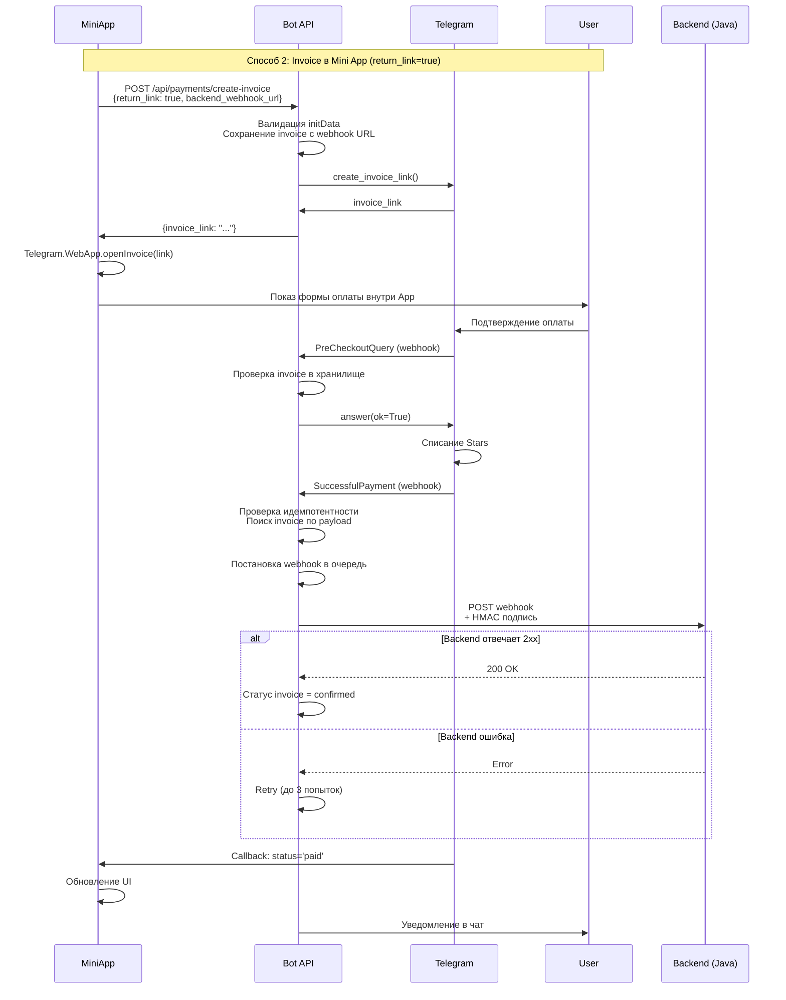

# Интеграция Telegram Stars Payments в Mini App

## 📋 Оглавление

1. [Обзор](#обзор)
2. [Архитектура](#архитектура)
3. [Backend API](#backend-api)
4. [Frontend Mini App](#frontend-mini-app)
5. [Тестирование](#тестирование)
6. [Безопасность](#безопасность)
7. [Troubleshooting](#troubleshooting)
8. [Backend Webhook Integration](#backend-webhook-integration)
9. [Конфигурация](#конфигурация)

---

## Обзор

Этот документ описывает интеграцию платежей через **Telegram Stars** в Telegram Mini App. Реализованы два способа проведения платежей:

### Способ 1: Invoice в чате (по умолчанию)
- Bot API отправляет invoice в чат с пользователем
- Пользователь открывает чат и подтверждает оплату
- Подходит для простых сценариев

### Способ 2: Invoice в Mini App (рекомендуется) ⭐
- Bot API возвращает `invoice_link`
- Mini App открывает форму оплаты через `Telegram.WebApp.openInvoice()`
- Пользователь остается в приложении
- Получаете мгновенный callback о результате
- **Лучший UX для Mini App!**

---

## Архитектура



---

## Backend API

### Endpoint: `POST /api/payments/create-invoice`

#### Request

```json
{
  "user_id": 141614461,
  "title": "Пакет генераций",
  "description": "Пакет на 10 генераций стикеров",
  "amount_stars": 100,
  "payload": "{\"package_id\": \"basic_10\"}",
  "return_link": true,  // 👈 Ключевой параметр!
  "backend_webhook_url": "https://backend.example.com/api/payments/telegram"  // 👈 Опционально: URL для уведомления backend
}
```

**Headers:**
```
Content-Type: application/json
X-Telegram-Init-Data: <initData>
```

#### Response

**Для `return_link: true`:**
```json
{
  "ok": true,
  "invoice_sent": false,
  "invoice_link": "https://t.me/$abcdef1234567890ABCDEF..."
}
```

**Для `return_link: false` (по умолчанию):**
```json
{
  "ok": true,
  "invoice_sent": true,
  "invoice_link": null
}
```

#### Параметры запроса

| Параметр | Тип | Обязательный | Описание |
|----------|-----|--------------|----------|
| `user_id` | int | Да | ID пользователя Telegram |
| `title` | string | Да | Заголовок платежа (1-32 символа) |
| `description` | string | Да | Описание платежа (1-255 символов) |
| `amount_stars` | int | Да | Количество Stars (> 0) |
| `payload` | string | Да | Данные для идентификации платежа (макс. 128 символов) |
| `return_link` | bool | Нет | `true` - вернуть ссылку, `false` - отправить в чат |
| `backend_webhook_url` | string | Нет | URL для уведомления backend о платеже (только HTTPS) |

---

## Frontend Mini App

### Установка Telegram WebApp SDK

Подключите SDK в вашем HTML:

```html
<script src="https://telegram.org/js/telegram-web-app.js"></script>
```

### Пример интеграции (JavaScript/TypeScript)

#### 1. Базовая функция создания платежа

```javascript
/**
 * Создает invoice и открывает форму оплаты в Mini App
 * @param {string} packageId - ID пакета
 * @param {number} amountStars - Количество Stars
 * @param {string} title - Название платежа
 * @param {string} description - Описание
 * @returns {Promise<string>} - Статус оплаты: 'paid', 'cancelled', 'failed', 'pending'
 */
async function createAndPayInvoice(packageId, amountStars, title, description) {
  const initData = Telegram.WebApp.initData;
  const userId = Telegram.WebApp.initDataUnsafe.user.id;
  
  if (!initData) {
    throw new Error('Telegram WebApp не инициализирован');
  }
  
  try {
    // 1. Создаем invoice через Bot API
    const response = await fetch('https://your-bot-api.com/api/payments/create-invoice', {
      method: 'POST',
      headers: {
        'Content-Type': 'application/json',
        'X-Telegram-Init-Data': initData
      },
      body: JSON.stringify({
        user_id: userId,
        title: title,
        description: description,
        amount_stars: amountStars,
        payload: JSON.stringify({ 
          package_id: packageId,
          timestamp: Date.now()
        }),
        return_link: true,  // 👈 Важно!
        backend_webhook_url: 'https://your-backend.com/api/payments/telegram'  // 👈 Опционально: для уведомления backend
      })
    });
    
    const data = await response.json();
    
    if (!data.ok || !data.invoice_link) {
      throw new Error(data.error || 'Не удалось создать invoice');
    }
    
    // 2. Открываем форму оплаты в Mini App
    return new Promise((resolve) => {
      Telegram.WebApp.openInvoice(data.invoice_link, (status) => {
        console.log('Payment status:', status);
        resolve(status);
      });
    });
    
  } catch (error) {
    console.error('Payment error:', error);
    throw error;
  }
}
```

#### 2. Использование в React

```jsx
import { useState } from 'react';

function PaymentButton({ packageId, price, title, description }) {
  const [isProcessing, setIsProcessing] = useState(false);
  
  const handlePayment = async () => {
    setIsProcessing(true);
    
    try {
      const status = await createAndPayInvoice(
        packageId,
        price,
        title,
        description
      );
      
      switch (status) {
        case 'paid':
          // ✅ Оплата успешна
          Telegram.WebApp.showAlert('Оплата прошла успешно! 🎉');
          // Обновляем UI, активируем пакет
          onPaymentSuccess(packageId);
          break;
          
        case 'cancelled':
          // ❌ Пользователь отменил
          Telegram.WebApp.showAlert('Оплата отменена');
          break;
          
        case 'failed':
          // ⚠️ Ошибка
          Telegram.WebApp.showAlert('Ошибка оплаты. Попробуйте снова.');
          break;
          
        case 'pending':
          // ⏳ В обработке (редко)
          Telegram.WebApp.showAlert('Платеж обрабатывается...');
          break;
      }
      
    } catch (error) {
      Telegram.WebApp.showAlert('Ошибка: ' + error.message);
    } finally {
      setIsProcessing(false);
    }
  };
  
  return (
    <button 
      onClick={handlePayment}
      disabled={isProcessing}
      className="payment-button"
    >
      {isProcessing ? 'Обработка...' : `Купить за ${price} ⭐`}
    </button>
  );
}
```

#### 3. Обработка результата платежа

```javascript
async function onPaymentSuccess(packageId) {
  // 1. Обновить локальное состояние
  updateUserBalance(packageId);
  
  // 2. Синхронизировать с бэкендом (опционально)
  await fetch('https://your-backend.com/api/activate-package', {
    method: 'POST',
    headers: {
      'Content-Type': 'application/json',
      'X-Telegram-Init-Data': Telegram.WebApp.initData
    },
    body: JSON.stringify({
      package_id: packageId,
      user_id: Telegram.WebApp.initDataUnsafe.user.id
    })
  });
  
  // 3. Показать анимацию успеха
  showSuccessAnimation();
  
  // 4. Обновить UI
  refreshPackagesList();
}
```

---

## Тестирование

### 1. Тестирование через curl

```bash
# Создание invoice с return_link и backend_webhook_url
curl -X POST https://stixly-e13nst.amvera.io/api/payments/create-invoice \
  -H "Content-Type: application/json" \
  -H "X-Telegram-Init-Data: user=%7B%22id%22%3A141614461...%7D&hash=..." \
  -d '{
    "user_id": 141614461,
    "title": "Тест",
    "description": "Тестовый платеж",
    "amount_stars": 1,
    "payload": "test",
    "return_link": true,
    "backend_webhook_url": "https://webhook.site/your-unique-id"
  }'

# Ожидаемый ответ:
# {
#   "ok": true,
#   "invoice_sent": false,
#   "invoice_link": "https://t.me/$..."
# }

# Создание invoice БЕЗ backend_webhook_url (обратная совместимость)
curl -X POST https://stixly-e13nst.amvera.io/api/payments/create-invoice \
  -H "Content-Type: application/json" \
  -H "X-Telegram-Init-Data: user=%7B%22id%22%3A141614461...%7D&hash=..." \
  -d '{
    "user_id": 141614461,
    "title": "Тест",
    "description": "Тестовый платеж",
    "amount_stars": 1,
    "payload": "test",
    "return_link": true
  }'
```

### 2. Тестирование в Mini App

1. Добавьте тестовую кнопку в ваш Mini App:
```html
<button onclick="testPayment()">Тест платежа (1 Star)</button>

<script>
async function testPayment() {
  const status = await createAndPayInvoice(
    'test_package',
    1,  // 1 Star для теста
    'Тестовый платеж',
    'Тест интеграции Stars'
  );
  console.log('Test payment status:', status);
}
</script>
```

2. Откройте Mini App в Telegram
3. Нажмите кнопку теста
4. Должна открыться форма оплаты **внутри приложения**
5. Подтвердите оплату

### 3. Мониторинг логов

```bash
# На сервере бота
tail -f logs/bot.log | grep -i payment

# Вы увидите:
# - "Creating invoice link: user_id=..."
# - "Invoice stored: invoice_id=..."
# - "Invoice link created successfully: ..."
# - "PreCheckoutQuery received: ..."
# - "Invoice validated: invoice_id=..."
# - "SuccessfulPayment received: ..."
# - "Payment marked as processed: charge_id=..."
# - "Backend webhook notification queued: ..."
# - "Webhook delivered successfully: ..."
```

---

## Безопасность

### 1. Валидация initData

Backend **обязательно** валидирует `initData` через HMAC-SHA256:

```python
# Автоматически в Bot API
validated_data = validate_telegram_init_data(
    init_data=init_data,
    bot_token=BOT_TOKEN,
    max_age_seconds=3600  # 1 час
)
```

### 2. Проверка user_id

API проверяет соответствие `user_id` из `initData` и `user_id` в запросе:

```python
if validated_user_id != invoice_request.user_id:
    raise HTTPException(403, "user_id mismatch")
```

### 3. Rate Limiting

Автоматическое ограничение запросов:
- 100 запросов/минуту по умолчанию
- Настраивается через `WEBHOOK_RATE_LIMIT` в `.env`

### 4. Payload для идентификации

Используйте `payload` для идентификации платежа:

```javascript
payload: JSON.stringify({
  package_id: 'premium_10',
  user_id: userId,
  timestamp: Date.now(),
  nonce: Math.random().toString(36)
})
```

**Важно:** Python-сервис автоматически оборачивает ваш payload в JSON с `invoice_id`:
```json
{
  "invoice_id": "uuid-here",
  "original_payload": "ваш_оригинальный_payload"
}
```

В `handle_successful_payment` извлеките данные:

```python
payload_data = json.loads(payment.invoice_payload)
original_payload = payload_data.get('original_payload', payment.invoice_payload)
package_data = json.loads(original_payload)
package_id = package_data.get('package_id')
```

### 5. Backend Webhook (новое)

Если указан `backend_webhook_url`, Python-сервис автоматически уведомит ваш backend после успешного платежа:

**Формат webhook запроса:**
```json
{
  "event": "telegram_stars_payment_succeeded",
  "user_id": 141614461,
  "amount_stars": 100,
  "currency": "XTR",
  "telegram_charge_id": "1234567890",
  "invoice_payload": "{\"package_id\": \"basic_10\"}",
  "timestamp": 1738500000,
  "signature": "hmac_sha256_hex_string"
}
```

**Заголовки:**
- `X-Webhook-Signature`: HMAC-SHA256 подпись (если настроен `BACKEND_WEBHOOK_SECRET`)
- `Content-Type`: application/json
- `User-Agent`: StickerBot-WebhookNotifier/1.0

**Backend должен:**
1. Проверить HMAC подпись (если настроена)
2. Обработать платеж (активировать тариф, начислить баланс и т.д.)
3. Вернуть HTTP 2xx для подтверждения

**Retry механизм:**
- При ошибке backend: автоматический retry до 3 попыток
- Exponential backoff: 1s, 2s, 4s
- Если все попытки неудачны - платеж остается в статусе `pending_delivery`

### 6. Идемпотентность платежей

Python-сервис гарантирует, что каждый `telegram_payment_charge_id` обрабатывается **строго один раз**, даже если Telegram отправляет дублирующиеся webhook'и. Это предотвращает двойное списание или активацию тарифа.

---

## Troubleshooting

### Проблема: "initData is too old"

**Причина:** initData устарел (> 1 часа)

**Решение:** 
- Обновите страницу Mini App
- Или увеличьте `PAYMENT_INITDATA_MAX_AGE_SECONDS` в `.env`

### Проблема: "Payments are currently disabled"

**Причина:** `PAYMENTS_ENABLED=false` в `.env`

**Решение:**
```bash
# В .env
PAYMENTS_ENABLED=true
```

### Проблема: "Missing Authorization header"

**Причина:** Не передан `initData` в заголовке

**Решение:**
```javascript
headers: {
  'X-Telegram-Init-Data': Telegram.WebApp.initData
}
```

### Проблема: "Invoice не открывается в Mini App"

**Причина:** Не передан `return_link: true`

**Решение:**
```json
{
  "return_link": true  // Добавить в request
}
```

### Проблема: "User ID mismatch"

**Причина:** `user_id` в запросе не совпадает с `user_id` из `initData`

**Решение:**
```javascript
const userId = Telegram.WebApp.initDataUnsafe.user.id;
// Используйте этот userId в запросе
```

### Проблема: "backend_webhook_url must use HTTPS protocol"

**Причина:** Указан HTTP URL вместо HTTPS

**Решение:**
```json
{
  "backend_webhook_url": "https://backend.example.com/webhook"  // Используйте HTTPS
}
```

### Проблема: "Backend webhook не доставляется"

**Проверьте:**
1. URL webhook доступен и принимает POST запросы
2. `BACKEND_WEBHOOK_SECRET` установлен (для HMAC подписи)
3. Backend правильно проверяет HMAC подпись
4. Логи бота на наличие ошибок retry

### Проблема: "Invoice не найден в хранилище"

**Причина:** Invoice истек (TTL 24 часа) или не был сохранен

**Решение:**
- Invoice автоматически удаляется через 24 часа
- Для production рекомендуется миграция на Redis/PostgreSQL (TODO в коде)

---

## Конфигурация

### Backend (.env)

```bash
# Платежи
PAYMENTS_ENABLED=true
PAYMENT_INITDATA_MAX_AGE_SECONDS=3600

# Webhook от Telegram (входящий)
TELEGRAM_WEBHOOK_TOKEN=your_telegram_secret_token  # Токен для проверки входящих webhook от Telegram

# Webhook к Backend (исходящий)
BACKEND_WEBHOOK_SECRET=your_backend_hmac_secret  # Секрет для HMAC подписи запросов к backend
BACKEND_WEBHOOK_RETRY_ATTEMPTS=3  # Количество попыток отправки webhook при ошибке
BACKEND_WEBHOOK_TIMEOUT_SECONDS=10  # Таймаут HTTP запроса к backend
INVOICE_TTL_HOURS=24  # Время хранения invoice в памяти (часы)

# Rate limiting
WEBHOOK_RATE_LIMIT=100/minute

# API
API_PORT=80
```

**Генерация секретов:**
```bash
# Для TELEGRAM_WEBHOOK_TOKEN
python3 -c "import secrets; print(secrets.token_urlsafe(32))"

# Для BACKEND_WEBHOOK_SECRET (HMAC)
python3 -c "import secrets; print(secrets.token_hex(32))"
```

### Frontend (config.js)

```javascript
const CONFIG = {
  botApiUrl: 'https://your-bot-api.com',
  
  packages: [
    {
      id: 'basic_10',
      name: 'Базовый',
      stars: 50,
      generations: 10
    },
    {
      id: 'premium_50',
      name: 'Премиум',
      stars: 200,
      generations: 50
    }
  ]
};
```

---

## Дополнительные ресурсы

- [Telegram Bot API - Payments](https://core.telegram.org/bots/api#payments)
- [Telegram Stars Documentation](https://core.telegram.org/bots/payments#telegram-stars)
- [Telegram WebApp Documentation](https://core.telegram.org/bots/webapps)
- [openInvoice Method](https://core.telegram.org/bots/webapps#initializing-mini-apps)

---

## Поддержка

Если возникли вопросы:
1. Проверьте логи: `tail -f logs/bot.log | grep payment`
2. Проверьте Network tab в DevTools Mini App
3. Убедитесь, что `PAYMENTS_ENABLED=true`
4. Проверьте, что `initData` актуален

---

---

## Backend Webhook Integration

### Формат уведомления

После успешного платежа Python-сервис отправляет POST запрос на указанный `backend_webhook_url`:

**URL:** `{backend_webhook_url}` (из запроса создания invoice)

**Method:** POST

**Headers:**
```
Content-Type: application/json
X-Webhook-Signature: {hmac_sha256_hex}  # Если настроен BACKEND_WEBHOOK_SECRET
User-Agent: StickerBot-WebhookNotifier/1.0
```

**Body (canonical JSON, ключи отсортированы, без пробелов):**
```json
{"amount_stars":100,"currency":"XTR","event":"telegram_stars_payment_succeeded","invoice_payload":"{\"package_id\": \"basic_10\"}","telegram_charge_id":"1234567890","timestamp":1738500000,"user_id":141614461}
```

**Примечание:** Подпись передается **только в заголовке** `X-Webhook-Signature`, не в теле запроса.

### Проверка HMAC подписи (Java пример)

**Важно:** Python-сервис использует **canonical JSON** для подписи:
- Ключи отсортированы в алфавитном порядке
- Без пробелов между элементами (`separators=(',', ':')`)
- UTF-8 кодировка
- `ensure_ascii=False` для корректной работы с Unicode

Backend должен создать **точно такой же canonical JSON** для проверки подписи:

```java
import javax.crypto.Mac;
import javax.crypto.spec.SecretKeySpec;
import java.nio.charset.StandardCharsets;
import java.security.MessageDigest;
import org.json.JSONObject;
import java.util.Iterator;

public boolean verifyWebhookSignature(
    String receivedSignature, 
    String requestBody, 
    String secret
) {
    try {
        // 1. Парсим JSON тело запроса
        JSONObject json = new JSONObject(requestBody);
        
        // 2. Создаем canonical JSON (JSONObject автоматически сортирует ключи)
        // Важно: используем toString() без форматирования (без пробелов)
        String canonicalJson = json.toString();
        
        // 3. Вычисляем HMAC-SHA256 подпись
        Mac sha256 = Mac.getInstance("HmacSHA256");
        SecretKeySpec secretKey = new SecretKeySpec(
            secret.getBytes(StandardCharsets.UTF_8), 
            "HmacSHA256"
        );
        sha256.init(secretKey);
        
        byte[] hash = sha256.doFinal(
            canonicalJson.getBytes(StandardCharsets.UTF_8)
        );
        String expectedSignature = bytesToHex(hash);
        
        // 4. Сравниваем подписи (защита от timing attacks)
        return MessageDigest.isEqual(
            receivedSignature.getBytes(StandardCharsets.UTF_8),
            expectedSignature.getBytes(StandardCharsets.UTF_8)
        );
        
    } catch (Exception e) {
        // Логируем ошибку
        logger.error("Error verifying webhook signature", e);
        return false;
    }
}

private String bytesToHex(byte[] bytes) {
    StringBuilder result = new StringBuilder();
    for (byte b : bytes) {
        result.append(String.format("%02x", b));
    }
    return result.toString();
}
```

**Пример использования в Spring Boot Controller:**

```java
@PostMapping("/api/payments/telegram")
public ResponseEntity<?> handleWebhook(
    @RequestBody String requestBody,
    @RequestHeader(value = "X-Webhook-Signature", required = false) String signature
) {
    // 1. Проверка подписи
    String secret = System.getenv("BACKEND_WEBHOOK_SECRET");
    if (secret != null && !secret.isEmpty()) {
        if (signature == null || !verifyWebhookSignature(signature, requestBody, secret)) {
            return ResponseEntity.status(401).body("Invalid signature");
        }
    }
    
    // 2. Парсим payload
    JSONObject payload = new JSONObject(requestBody);
    String event = payload.getString("event");
    
    if ("telegram_stars_payment_succeeded".equals(event)) {
        // 3. Обработка платежа
        long userId = payload.getLong("user_id");
        int amountStars = payload.getInt("amount_stars");
        String chargeId = payload.getString("telegram_charge_id");
        
        // Активируем тариф, начисляем баланс и т.д.
        processPayment(userId, amountStars, chargeId);
        
        // 4. Возвращаем успешный ответ
        return ResponseEntity.ok().body("Payment processed");
    }
    
    return ResponseEntity.badRequest().body("Unknown event");
}
```

**Важные моменты:**

1. **Canonical JSON:** Используйте `JSONObject.toString()` без форматирования - он автоматически сортирует ключи и убирает пробелы
2. **UTF-8:** Всегда используйте UTF-8 кодировку для тела запроса и секрета
3. **Timing attacks:** Используйте `MessageDigest.isEqual()` вместо `String.equals()` для сравнения подписей
4. **Логирование:** Не логируйте секрет или подпись в открытом виде

### Retry механизм

Если backend возвращает ошибку (не 2xx):
- **Попытка 1:** немедленно
- **Попытка 2:** через 1 секунду
- **Попытка 3:** через 2 секунды
- **Попытка 4:** через 4 секунды (если настроено больше 3)

После всех неудачных попыток платеж остается в статусе `pending_delivery` для ручной обработки.

---

**Версия документа:** 2.0  
**Дата обновления:** 2026-02-02  
**Изменения:** Добавлена поддержка backend webhook, HMAC подписи, идемпотентности платежей
