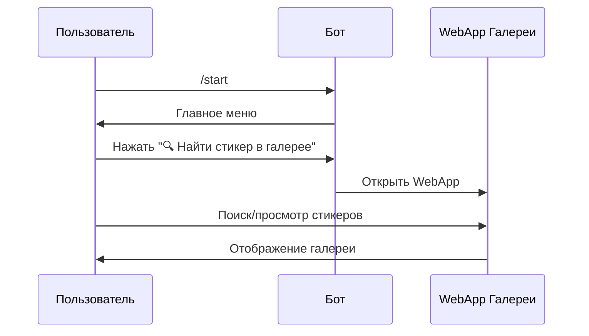
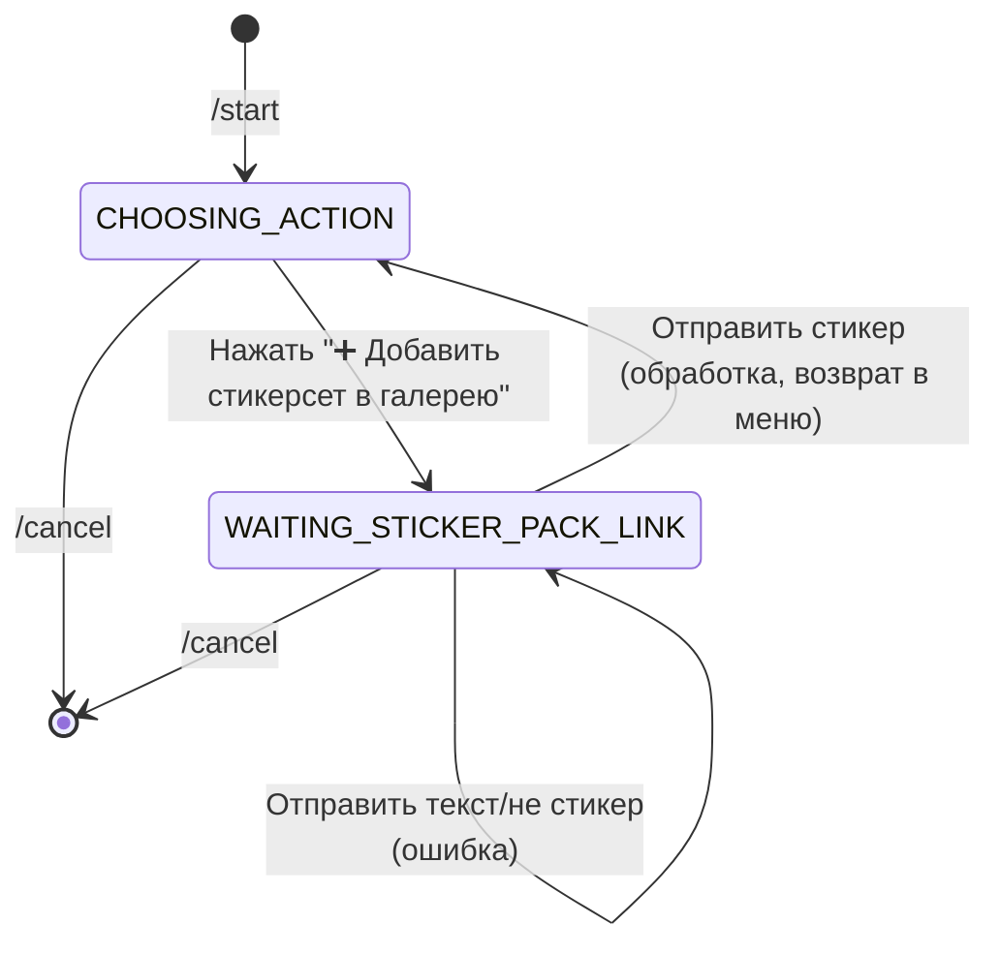
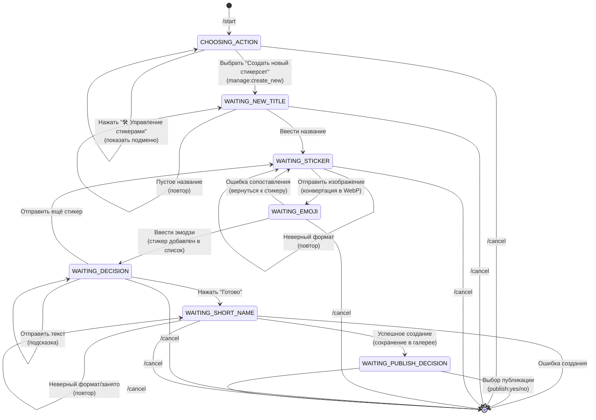
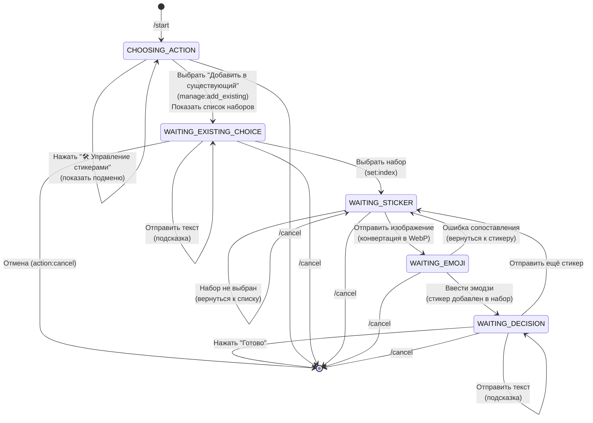
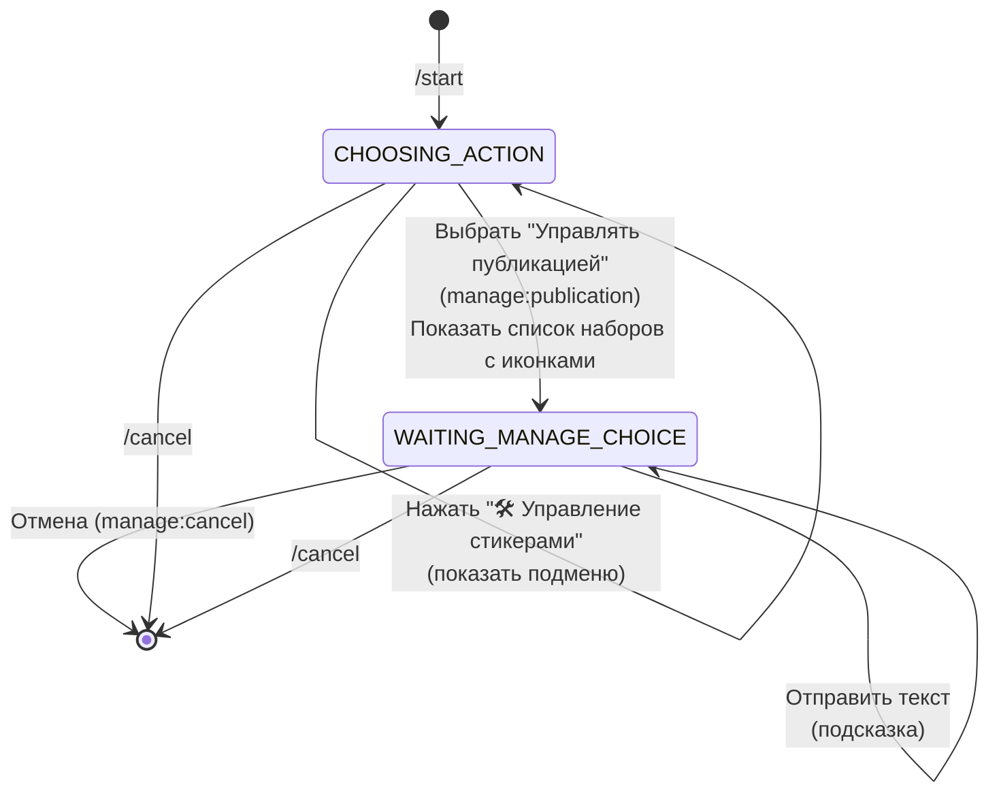
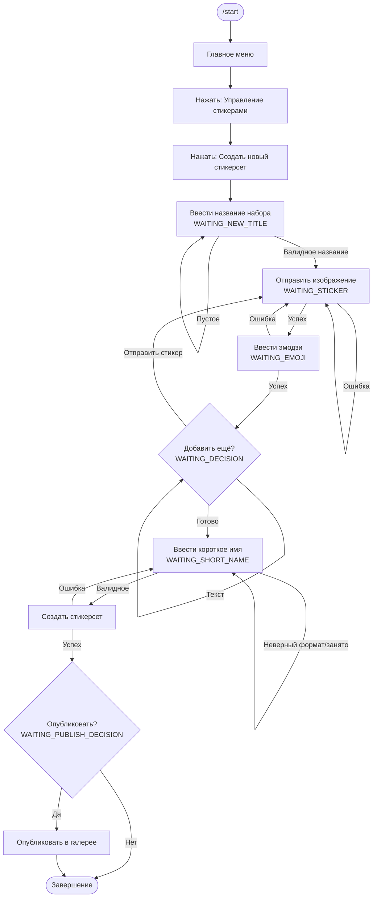
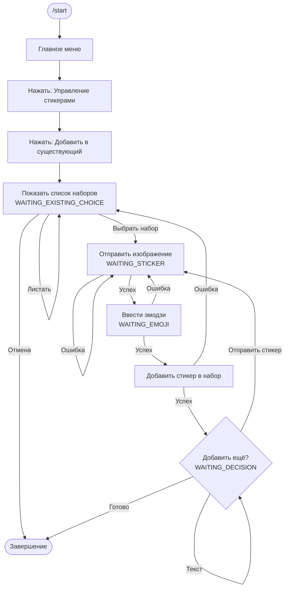

# Схемы пользовательских путей в StickerBot

Этот документ описывает все пользовательские пути (user journeys) внутри Telegram-бота StickerBot. Здесь представлены диаграммы переходов между состояниями, последовательности действий и справочная информация о структуре бота.

## Содержание

1. [Общая структура навигации](#общая-структура-навигации)
2. [Путь 1: Поиск стикера в галерее](#путь-1-поиск-стикера-в-галерее)
3. [Путь 2: Добавление стикерсета в галерею](#путь-2-добавление-стикерсета-в-галерею)
4. [Путь 3: Создание нового стикерсета](#путь-3-создание-нового-стикерсета)
5. [Путь 4: Добавление стикера в существующий стикерсет](#путь-4-добавление-стикера-в-существующий-стикерсет)
6. [Путь 5: Управление публикацией](#путь-5-управление-публикацией)
7. [Детальные потоки](#детальные-потоки)
8. [Таблица состояний](#таблица-состояний-бота)
9. [Callback-данные](#callback-данные-callback_data)
10. [Общая схема переходов](#общая-схема-переходов-между-состояниями)

## Общая структура навигации

```mermaid
graph TD
    Start[/start] --> MainMenu[Главное меню<br/>CHOOSING_ACTION]
    
    MainMenu --> WebApp[🔍 Найти стикер в галерее<br/>WebApp - внешнее приложение]
    MainMenu --> AddPack[➕ Добавить стикерсет в галерею<br/>WAITING_STICKER_PACK_LINK]
    MainMenu --> ManageBtn[🛠 Управление стикерами<br/>callback: manage_stickers_menu]
    
    ManageBtn --> ManageMenu[Подменю управления<br/>CHOOSING_ACTION]
    
    ManageMenu --> CreateNew[Создать новый стикерсет<br/>WAITING_NEW_TITLE]
    ManageMenu --> AddExisting[Добавить в существующий<br/>WAITING_EXISTING_CHOICE]
    ManageMenu --> ManagePub[Управлять публикацией<br/>WAITING_MANAGE_CHOICE]
    ManageMenu --> BackMain[Назад в главное меню<br/>callback: back_to_main]
    
    WebApp -.->|возврат| MainMenu
    AddPack --> MainMenu
    CreateNew --> MainMenu
    AddExisting --> MainMenu
    ManagePub --> MainMenu
    BackMain --> MainMenu
    
    style MainMenu fill:#e1f5ff
    style ManageMenu fill:#fff4e1
```

## Путь 1: Поиск стикера в галерее



## Путь 2: Добавление стикерсета в галерею



## Путь 3: Создание нового стикерсета



## Путь 4: Добавление стикера в существующий стикерсет



## Путь 5: Управление публикацией



## Детальный поток создания нового стикерсета



## Детальный поток добавления в существующий набор



## Таблица состояний бота

| Состояние | Код | Описание |
|-----------|-----|----------|
| `CHOOSING_ACTION` | 0 | Главное меню, выбор действия |
| `WAITING_NEW_TITLE` | 1 | Ожидание названия нового стикерсета |
| `WAITING_STICKER` | 2 | Ожидание изображения стикера |
| `WAITING_EMOJI` | 3 | Ожидание эмодзи для стикера |
| `WAITING_DECISION` | 4 | Ожидание решения (добавить ещё или готово) |
| `WAITING_SHORT_NAME` | 5 | Ожидание короткого имени для стикерсета |
| `WAITING_EXISTING_CHOICE` | 6 | Ожидание выбора существующего набора |
| `WAITING_PUBLISH_DECISION` | 7 | Ожидание решения о публикации |
| `WAITING_MANAGE_CHOICE` | 8 | Ожидание выбора набора для управления публикацией |
| `WAITING_STICKER_PACK_LINK` | 9 | Ожидание стикера для добавления стикерсета в галерею |

## Основные действия и переходы

### Главное меню (CHOOSING_ACTION)
- **Вход:** `/start`, `back_to_main`
- **Выход:**
  - WebApp (поиск в галерее)
  - `WAITING_STICKER_PACK_LINK` (добавить стикерсет)
  - `WAITING_EXISTING_CHOICE` (управление → добавить в существующий)
  - `WAITING_NEW_TITLE` (управление → создать новый)
  - `WAITING_MANAGE_CHOICE` (управление → публикация)

### Отмена (`/cancel`)
- Доступна в любом состоянии
- Очищает `user_data`
- Возвращает `ConversationHandler.END` (-1)

## Общая схема переходов между состояниями

```mermaid
graph TB
    subgraph "Точка входа"
        START[/start]
    end
    
    subgraph "Главное меню"
        MAIN[CHOOSING_ACTION]
    end
    
    subgraph "Поиск в галерее"
        WEBAPP[WebApp Галереи]
    end
    
    subgraph "Добавление стикерсета"
        WAIT_PACK[WAITING_STICKER_PACK_LINK]
    end
    
    subgraph "Создание нового набора"
        WAIT_TITLE[WAITING_NEW_TITLE]
        WAIT_STICKER1[WAITING_STICKER]
        WAIT_EMOJI1[WAITING_EMOJI]
        WAIT_DECISION1[WAITING_DECISION]
        WAIT_SHORT[WAITING_SHORT_NAME]
        WAIT_PUBLISH[WAITING_PUBLISH_DECISION]
    end
    
    subgraph "Добавление в существующий"
        WAIT_EXISTING[WAITING_EXISTING_CHOICE]
        WAIT_STICKER2[WAITING_STICKER]
        WAIT_EMOJI2[WAITING_EMOJI]
        WAIT_DECISION2[WAITING_DECISION]
    end
    
    subgraph "Управление публикацией"
        WAIT_MANAGE[WAITING_MANAGE_CHOICE]
    end
    
    START --> MAIN
    MAIN --> WEBAPP
    MAIN --> WAIT_PACK
    MAIN --> WAIT_EXISTING
    MAIN --> WAIT_TITLE
    MAIN --> WAIT_MANAGE
    
    WAIT_PACK --> MAIN
    WEBAPP -.->|возврат| MAIN
    
    WAIT_TITLE --> WAIT_STICKER1
    WAIT_STICKER1 --> WAIT_EMOJI1
    WAIT_EMOJI1 --> WAIT_DECISION1
    WAIT_DECISION1 --> WAIT_STICKER1
    WAIT_DECISION1 --> WAIT_SHORT
    WAIT_SHORT --> WAIT_PUBLISH
    WAIT_PUBLISH --> END1[END]
    WAIT_TITLE --> END1
    
    WAIT_EXISTING --> WAIT_STICKER2
    WAIT_STICKER2 --> WAIT_EMOJI2
    WAIT_EMOJI2 --> WAIT_DECISION2
    WAIT_DECISION2 --> WAIT_STICKER2
    WAIT_DECISION2 --> END2[END]
    
    WAIT_MANAGE --> END3[END]
    
    style MAIN fill:#e1f5ff
    style WAIT_STICKER1 fill:#fff4e1
    style WAIT_STICKER2 fill:#fff4e1
    style WAIT_EMOJI1 fill:#ffe1f5
    style WAIT_EMOJI2 fill:#ffe1f5
```

## Callback-данные (callback_data)

| Callback | Описание | Обработчик |
|----------|----------|------------|
| `add_pack_from_sticker` | Добавить стикерсет в галерею | `handle_add_pack_from_sticker` |
| `manage_stickers_menu` | Показать меню управления стикерами | `handle_manage_stickers_menu` |
| `back_to_main` | Вернуться в главное меню | `handle_back_to_main` |
| `manage:create_new` | Создать новый стикерсет | `create_new_set` |
| `manage:add_existing` | Добавить в существующий | `add_to_existing` |
| `manage:publication` | Управлять публикацией | `manage_publication` |
| `set:0`, `set:1`, ... | Выбор набора по индексу | `handle_existing_choice` |
| `page:next` | Следующая страница | `show_existing_sets` |
| `page:prev` | Предыдущая страница | `show_existing_sets` |
| `action:cancel` | Отмена действия | `handle_existing_choice` |
| `manage:set:0`, `manage:set:1`, ... | Выбор набора для управления | `handle_manage_choice` |
| `manage:page:next` | Следующая страница (управление) | `show_manage_sets` |
| `manage:page:prev` | Предыдущая страница (управление) | `show_manage_sets` |
| `manage:cancel` | Отмена управления | `handle_manage_choice` |
| `manage:unpublish` | Снять с публикации | `handle_manage_choice` |
| `manage:back` | Вернуться к списку | `handle_manage_choice` |
| `publish:yes` | Опубликовать набор | `handle_publish_choice` |
| `publish:no` | Оставить приватным | `handle_publish_choice` |

## Обработка ошибок

1. **Ошибка обработки изображения** → вернуться в `WAITING_STICKER`
2. **Ошибка создания стикерсета** → вернуться в `WAITING_SHORT_NAME`
3. **Ошибка добавления стикера** → вернуться к выбору набора
4. **Глобальная ошибка** → уведомить пользователя, продолжить работу
5. **Ошибка загрузки списка наборов** → завершить диалог, предложить начать заново

## Особенности реализации

### Многократное использование состояний
Некоторые состояния используются в разных потоках:
- `WAITING_STICKER` — для создания нового набора и добавления в существующий
- `WAITING_EMOJI` — общее состояние для всех операций со стикерами
- `WAITING_DECISION` — используется в обоих потоках добавления стикеров

### Определение контекста действия
Действие пользователя определяется через `context.user_data['action']`:
- `'create_new'` — создание нового стикерсета
- `'add_existing'` — добавление в существующий набор
- `'add_pack_from_sticker'` — добавление стикерсета в галерею
- `'manage_publication'` — управление публикацией

### Пагинация
Списки наборов отображаются с пагинацией:
- По 10 элементов на страницу
- Навигация через кнопки "⬅️ Назад" / "➡️ Вперед"
- Состояние страницы хранится в `context.user_data`

## Текстовая схема пользовательских путей

```
┌─────────────────────────────────────────────────────────────────┐
│                           /start                                 │
└───────────────────────┬─────────────────────────────────────────┘
                        │
                        ▼
            ┌───────────────────────┐
            │  Главное меню (0)     │
            │  CHOOSING_ACTION      │
            └───────────┬───────────┘
                        │
        ┌───────────────┼───────────────┬──────────────────┐
        │               │               │                  │
        ▼               ▼               ▼                  ▼
   [WebApp]     [Добавить пак]  [Управление]         [Другие...]
                (WAITING_      ──────────────────┐
                 STICKER_      │                 │
                 PACK_LINK)    │                 │
                               ▼                 │
                        ┌───────────────┐        │
                        │ Подменю       │        │
                        └───────┬───────┘        │
                                │                 │
                ┌───────────────┼───────────────┐│
                │               │               ││
                ▼               ▼               ▼│
        [Создать новый]  [В существующий]  [Публикация]
        WAITING_NEW_     WAITING_EXISTING  WAITING_MANAGE
        TITLE           _CHOICE            _CHOICE
                │               │               │
                ▼               ▼               ▼
        [Создание...]   [Добавление...]   [Управление...]
                │               │               │
                └───────────────┴───────────────┘
                                │
                                ▼
                        ┌───────────────┐
                        │  Завершение   │
                        │  (END или 0)  │
                        └───────────────┘

Основные потоки:

1. Поиск в галерее:
   /start → Главное меню → WebApp (внешнее)

2. Добавление стикерсета:
   /start → Главное меню → WAITING_STICKER_PACK_LINK → Главное меню

3. Создание нового набора:
   /start → Главное меню → Управление → Создать новый →
   WAITING_NEW_TITLE → WAITING_STICKER → WAITING_EMOJI →
   WAITING_DECISION → WAITING_SHORT_NAME → WAITING_PUBLISH_DECISION → END

4. Добавление в существующий:
   /start → Главное меню → Управление → В существующий →
   WAITING_EXISTING_CHOICE → WAITING_STICKER → WAITING_EMOJI →
   WAITING_DECISION → END

5. Управление публикацией:
   /start → Главное меню → Управление → Публикация →
   WAITING_MANAGE_CHOICE → END
```

